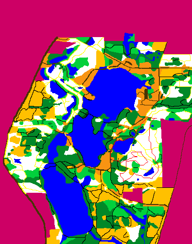
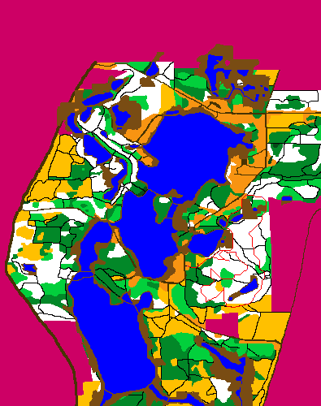
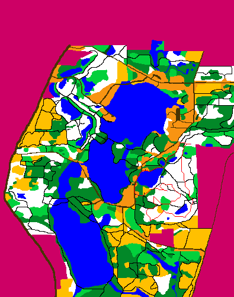
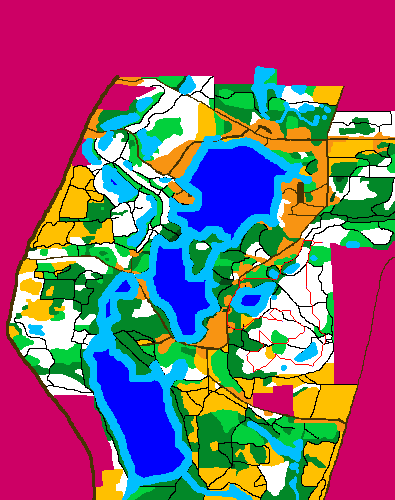

# Orienteering Path Finder using A* algorithm

Given a map of [Orienteering](https://en.wikipedia.org/wiki/Orienteering) which includes multiple checkpoints, find the path to win the game in shortest time. Different seasons have different conditions to be dealt with. The map I used shows Mendon Park in Rochester, NY

 ## Dependencies
 - Python 3.6
 - [Pillow](https://pillow.readthedocs.io/en/stable/installation.html)

## Output

1. Oiriginal Terrain (Input)

2. Fall

2. Spring

3. Summer

4. Winter

